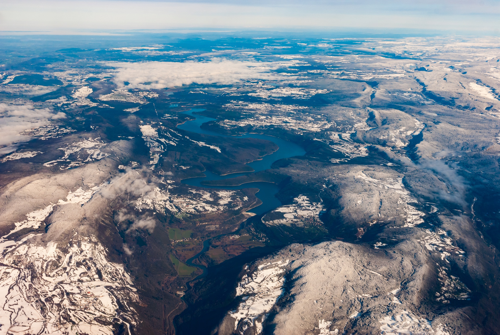

# Topography Classifier

## Project Description

The **Topography Classifier** is a deep learning-based project designed to classify satellite images into various topographical categories. The goal of this project is to automate the analysis and classification of satellite imagery, which is crucial for environmental monitoring, land management, and urban planning. 

The model is trained on a dataset of satellite images and can classify images into the following categories:
- **Sky/Cloud**
- **Water**
- **Desert**
- **Forest**

By using convolutional neural networks (CNNs), the system can automatically recognize different terrain features from aerial images, making it an invaluable tool for various industries, such as agriculture, environmental research, and urban development.

This project is implemented using Python and deep learning frameworks like TensorFlow and Keras, providing both a robust machine learning model and a user-friendly interface hosted on Streamlit.

## Features

- **Image Classification**: Classifies satellite images into one of four topographical categories: Sky/Cloud, Water, Desert, or Forest.
- **Deep Learning Model**: Built using Convolutional Neural Networks (CNNs) for high-accuracy classification.
- **User-Friendly Interface**: Web-based application developed using Streamlit, allowing users to upload and classify satellite images easily.
- **Real-Time Predictions**: The model provides instant classification results after uploading an image.
- **Cloud Deployment**: The app is hosted on **Streamlit Cloud**, making it easily accessible from anywhere.


## Technologies Used

- **Python**: The primary programming language for the project.
- **TensorFlow/Keras**: Deep learning libraries used to build and train the model.
- **Streamlit**: A Python library used to create the interactive web-based interface.
- **NumPy & Pandas**: Data manipulation and processing libraries.
- **Matplotlib & Seaborn**: For visualization of the model's performance.
- **OpenCV**: For image processing tasks.

## How It Works

1. **Image Upload**: Users upload satellite images via the web interface. The interface is designed to be simple, allowing users to drag and drop images easily.
2. **Model Inference**: After the image is uploaded, the model processes the image and classifies it into one of the predefined categories (Sky/Cloud, Water, Desert, Forest) based on learned features.
3. **Result Display**: The classification result is displayed on the screen with a confidence score, indicating the topographical classification predicted by the model.

### Process Flow:
- **Data Preprocessing**: Images are resized and normalized to fit the input requirements of the CNN model.
- **Model Training**: A CNN model is trained using a labeled dataset of satellite images. The model learns features like textures and patterns that distinguish different topographical categories.
- **Prediction**: After training, the model can classify new, unseen satellite images with high accuracy.
## Demo Video:
[](https://youtu.be/2vzRl2ubPQM)


.gif)
.gif)
.gif)


Click on the above image for the video

## Demo Screenshot

Below is a screenshot of the **Topography Classifier App** in action:
### Home Page


### About Dataset


### About me


### Prediction


### Confusion Matrix


*The image shows the app interface where you can upload satellite images and get predictions based on the topography category.*

## Installation

To run the Topography Classifier project locally, follow the steps below:

1. **Clone the Repository**:
   ```bash
   git clone https://github.com/Pranaykarvi/topography_classifier.git
